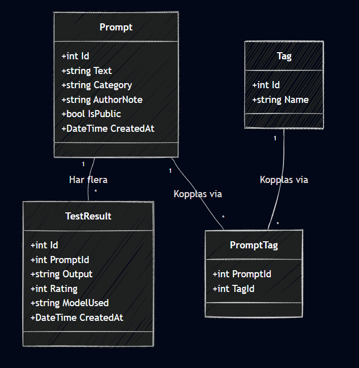

# PromptVault API

A REST API for storing, categorizing, and live-testing AI prompts. Send your prompts to OpenAI GPT and automatically save the responses for comparison and rating.

## Getting Started

### Prerequisites
- .NET 9.0 SDK
- SQL Server (LocalDB or Express)
- An OpenAI API key ([platform.openai.com](https://platform.openai.com))

### Setup

1. Clone the repository
2. Navigate to the project folder
3. Configure your OpenAI API key using User Secrets:
   ```bash
   dotnet user-secrets init
   dotnet user-secrets set "OpenAI:ApiKey" "your-api-key-here"
   ```
4. Update the connection string in `appsettings.Development.json` if needed
5. Apply database migrations and run:
   ```bash
   dotnet ef database update
   dotnet run
   ```

The API will be available at `http://localhost:5212`. The database is automatically seeded with sample data on first run.

## Architecture

| Technology | Purpose |
|---|---|
| **Entity Framework Core** | Database management using Code First approach with SQL Server |
| **AutoMapper** | Mapping between database models and DTOs to keep API responses clean |
| **FluentValidation** | Input validation with clear, structured rules |
| **Bogus** | Generates realistic seed data for development and testing |
| **Global Exception Handling** | Middleware that catches all exceptions and returns consistent JSON error responses |

### Project Structure

```
Controllers/         API endpoints (thin controllers that delegate to services)
Services/            Business logic layer
  Interfaces/        Service contracts (dependency inversion)
Models/              EF Core database models
Dtos/                Data Transfer Objects (input/output separation)
AutoMapper/          Mapping profiles between models and DTOs
Validators/          FluentValidation rules
Middleware/          Global exception handling
Database/            DbContext and seeder
Configuration/       Settings classes (OpenAI config)
Postman/             Postman collection for API testing
```

## API Endpoints

### Prompts
| Method | Endpoint | Description |
|---|---|---|
| GET | `/api/prompts` | Get all prompts |
| GET | `/api/prompts/{id}` | Get a specific prompt |
| GET | `/api/prompts/top-rated` | Get top 10 public prompts by average rating |
| POST | `/api/prompts` | Create a new prompt |
| PUT | `/api/prompts/{id}` | Update a prompt |
| DELETE | `/api/prompts/{id}` | Delete a prompt |
| POST | `/api/prompts/{id}/run` | Run prompt against OpenAI GPT |

### Tags
| Method | Endpoint | Description |
|---|---|---|
| GET | `/api/tags` | Get all tags |
| GET | `/api/tags/{id}` | Get a specific tag |
| POST | `/api/tags` | Create a new tag |
| DELETE | `/api/tags/{id}` | Delete a tag |

### Test Results
| Method | Endpoint | Description |
|---|---|---|
| GET | `/api/testresults/prompt/{promptId}` | Get all results for a prompt |
| POST | `/api/testresults` | Create a test result |
| DELETE | `/api/testresults/{id}` | Delete a test result |

## OpenAI Integration

The `/api/prompts/{id}/run` endpoint connects to OpenAI's Chat Completions API. When called, the system fetches the prompt text from the database, sends it to GPT-4o-mini, and automatically saves the AI response as a new TestResult with `rating: 0` (unrated). This allows users to compare how different prompts perform and rate the outputs.

## Postman Collection

A ready-made Postman collection is included in the `/Postman` folder. Import `PromptVault.postman_collection.json` into Postman to quickly test all endpoints with pre-configured request bodies and example data.

## UML Diagram


